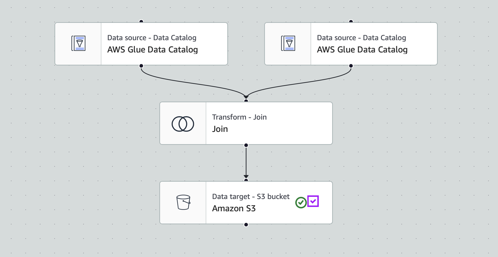

# Data Engineering Project: End-to-End ETL Data Pipeline for Processing and Analyzing YouTube Trends on AWS ▶️📊

## 🚀 Project Overview

This project is a complete end-to-end data engineering pipeline for analyzing YouTube data using AWS cloud services. The core goal is to extract insights from raw CSV and JSON data formats using AWS Glue, Lambda, Athena, and QuickSight.

Through this project, I aimed to strengthen my understanding of:
- Cloud data lakes and cataloging using AWS
- Real-world challenges with JSON normalization
- Automating ETL workflows with Lambda and PySpark
- Building analytical dashboards with Athena and QuickSight

---

## 🧰 AWS Services & Tools Used

- **IAM** – Create roles with attached required policies for AWS services to acccess another service
- **Amazon S3** – Storage of raw and processed data
- **AWS CLI** – Upload data to S3 with hive-style partitioning
- **AWS Lambda** – Transform/normalize JSON to Parquet
- **AWS Glue** – Data cataloging, crawling, and ETL jobs (both visual and PySpark-based)
- **Amazon Athena** – Serverless querying of datasets
- **Amazon QuickSight** – Dashboard and reporting
- **Amazon CloudWatch** – Logging errors and outputs for debugging and data verification

---

## 🧠 Prerequisites

- An active **AWS Account**
- **AWS CLI** installed and configured with credentials
- Familiarity with:
  - **Python**
  - **PySpark**
  - Basic **AWS Services** (especially Glue, S3, Lambda, Athena, QuickSight)
- IAM roles/policies granting S3, Glue, Lambda, and Athena access

---

## 📊 Dataset Used: Trending YouTube Video Statistics

A daily-record dataset of top trending YouTube videos across multiple countries, originally compiled by **datasnaek** and hosted on Kaggle.
**Link** - https://www.kaggle.com/datasets/datasnaek/youtube-new/data

- Covers trending videos from **14 November 2017 to 14 June 2018** (7‑month period).
- Includes up to **200 daily trending videos per country**.
- Countries included: **USA, Canada, Great Britain, Germany, France, Russia, India, Japan, South Korea, Mexico**.
- Intended for trend analysis, visualization, and predictive modeling based on public engagement metrics.

### 📅 Estimated Record Count per Country File(CSV)

| Item                          | Value                          |
|-------------------------------|--------------------------------|
| Date Range                    | 14 Nov 2017 – 14 Jun 2018      |
| Number of Days                | 213                            |
| Videos per Day                | 200                            |
| Approximate Records per File | **42,600**                     |
| Number of Countries           | 10                             |
| Total Records (All Files)     | ~**426,000**                   |

> ⚠️ Note: Actual counts may vary slightly due to video removals, regional restrictions, or missing data on certain days.


### 📁 Files

### CSV Files (one per country)

Each CSV file (e.g., `USvideos.csv`, `INvideos.csv`) includes:

| Column                 | Description                                                                 |
|------------------------|-----------------------------------------------------------------------------|
| `video_id`             | Unique video identifier                                                     |
| `trending_date`        | Date when the video appeared on trending list (format: YY.DD.MM)           |
| `publish_time`         | ISO‑8601 UTC timestamp when uploaded                                        |
| `title`, `channel_title` | Video title and channel name                                              |
| `category_id`          | Numeric category code (**country‑specific**)                                   |
| `tags`                 | List of video tags separated by `\|`                                        |
| `views`, `likes`, `dislikes`, `comment_count` | Engagement metrics                                   |
| `description`          | Video description text                                                     |
| `comments_disabled`, `ratings_disabled`, `video_error_or_removed` | Boolean flags for video status |

- Up to **16 columns per file**.
- Contains daily snapshots.
> ⚠️ Note: Some videos may appear multiple times across days if still trending.

### JSON Files (one per country)

E.g., `US_category_id.json`, `IN_category_id.json`:

```json
{
   "kind":"youtube#videoCategoryListResponse",
   "etag":"\"ld9biNPKjAjgjV7EZ4EKeEGrhao/1v2mrzYSYG6onNLt2qTj13hkQZk\"",
   "items":[
      {
         "kind":"youtube#videoCategory",
         "etag":"\"ld9biNPKjAjgjV7EZ4EKeEGrhao/Xy1mB4_yLrHy_BmKmPBggty2mZQ\"",
         "id":"1",
         "snippet":{
            "channelId":"UCBR8-60-B28hp2BmDPdntcQ",
            "title":"Film & Animation",
            "assignable":true
         }
      },
      {
         "kind":"youtube#videoCategory",
         "etag":"\"ld9biNPKjAjgjV7EZ4EKeEGrhao/UZ1oLIIz2dxIhO45ZTFR3a3NyTA\"",
         "id":"2",
         "snippet":{
            "channelId":"UCBR8-60-B28hp2BmDPdntcQ",
            "title":"Autos & Vehicles",
            "assignable":true
         }
      },
      ...
    ]
}
```


#### 🧾 What Is the JSON Data?

Each `*_category_id.json` file provides metadata about YouTube video categories for a specific region (e.g., `US_category_id.json`).

- It maps each **numeric `category_id`** (used in the CSV files) to a **human-readable category name** like `"Music"` or `"Sports"`.
- The data is nested: you'll find a list of `items`, where each `item` contains an `id` and a `snippet.title`.

To interpret:
- Match the `category_id` in the CSV to the `id` in JSON
- Extract `snippet.title` as the actual category name
> ⚠️ Note: The other fields (like `channelId`, `etag`, etc.) are metadata from the YouTube API and aren't needed for mapping or analysis.

---


## 📂 Project Workflow

### 1. 📥 Upload Raw Data to S3

- Download raw **CSV** and **JSON** data locally in `~/../<project_folder>/data/` folder.
- Create an S3 bucket and upload the data:
  - CSV files with **Hive-style partitioning** (e.g., `/region=us/`, `/region=ca/`)
  - JSON files stored in a separate folder without partitioning
- Use `aws s3 cp` or `aws s3 sync` via AWS CLI for uploads.
> Full commands - [S3-CLI-Command.sh](S3-CLI-Command.sh)

---

### 2. 🧭 Glue Catalog for JSON (Initial Attempt)

- Tried creating a **Glue Crawler** over JSON data.
- Encountered issues due to **Glue's limited support for nested JSON structures**.
- Decided to normalize the JSON before further processing.
> ✅ **Note** - Here I also created `youtubeanalysis-glue-s3-role` role in `IAM` with following policies: `AmazonS3FullAccess` and `AWSGlueServiceRole` to give Glue access to S3 buckets. 

---

### 3. 🔁 JSON Normalization with Lambda

- Wrote a **Lambda function** to:
  - Read JSON from raw S3
  - Normalize/flatten JSON
  - Write as **Parquet** to a new "cleaned" S3 bucket
- Successfully tested on one file using `S3 Put` event.
- Verified results using **Athena** queries on the generated **Glue Catalog**.

``` sql
SELECT * FROM "AwsDataCatalog"."db_youtube_cleaned"."cleaned_statistics_ref_data" limit 10;
```
  
> ✅ **Note** - 1. Created another role `youtubeanalysis-lambda-s3-role` with full access to S3 `AmazonS3FullAccess` and Glue `AWSGlueServiceRole` 2. Used Lambda Layers `AWSSDKPandas-Python39` version `28` for the dependecy packages. 3. Modified the `timeout:3min`, `memory:256MB` and `storage:512MB` for seamless run.

---

### 4. 🕸️ Glue Crawler for CSV Data

- Created a **Glue Crawler** to crawl the partitioned CSV files.
- Table was created with **`region`** as the partition key.

---

### 5. 🔗 Joining Reference and Raw Tables

- Used **Athena** to join the JSON (reference) and CSV (raw) tables.
- Adjusted data types in the Glue catalog to avoid repeated casting.

---

## 🛠️ Production Workflow

### 6. 🔄 Automate JSON Normalization

- Added an **S3 trigger** on the raw JSON folder to invoke the Lambda function.
- Lambda automatically creates a Parquet version of each `.json` file in a different bucket under `cleaned_statistics_ref_data` folder and updates(`append`) the Glue catalog.

> ✅ **Note** - Triggers will be `All object create event` i.e. `PUT`, `POST`, `COPY` of only `.json` type in the JSON data source folder.

---

### 7. 🧪 ETL for CSV Data with PySpark

- Initially attempted Glue Visual ETL – faced encoding & special character issues. [Visual_to_Glue_Spark_Script_Failed.py](Visual_to_Glue_Spark_Script_Failed.py)
- Switched to **custom PySpark job**: [Glue_PySpark_ETL_CSV_to_Parquet.py](Glue_PySpark_ETL_CSV_to_Parquet.py)
  - Read CSV from raw S3
  - Added "region" column manually
  - Applied transformations i.e. type conversion of `string` columns to `long` and `boolean` wherever necessary
  - Wrote cleaned Parquet to a new S3 location under `raw_data_transformed` folder partitioned by `region`
- Created a new Glue Crawler to crawl the cleaned raw folder `raw_data_transformed` to create a new catalog table with partition column `region`.

> ✅ **Note** - Verified data by joining both reference(JSON now parquet) and raw(CSV now parquet) in **Athena**.
``` sql
-- join raw transformed catalog table with the cleaned ref catalog table
-- produces 3,734,265 records
-- this then is implemented in Glue Visual ETL job to create 1 final data for analysis/reporting.
SELECT * 
FROM "db_youtube_cleaned"."cleaned_statistics_ref_data" ref 
INNER JOIN "db_youtube_cleaned"."raw_data_transformed" raw 
ON ref.id = raw.category_id
;
```

---

### 8. 🔁 Final Join with Glue Visual ETL

- Used **Glue Visual ETL Job** to join the cleaned raw(`raw_data_transformed`) and ref(`cleaned_statistics_ref_data`) catalogs tables on `raw.category_id` = `ref.id`.
- Output(a `parquet` file) written to a new **Final Analytics** S3 bucket under `combined_ref_raw/` folder.
- Also the ETL job creates a Glue catalog table `combined_ref_raw_catalog` from the final joined data with two partition keys `region` and `category_id`. 



**Auto generated PySpark Code** - [Glue_Visual_ETL_Final_Combined_Raw_n_Ref_data.py](Glue_Visual_ETL_Final_Combined_Raw_n_Ref_data.py)

---

### 9. 📊 Visualization with QuickSight

- Connected **QuickSight** to **Athena**.
- Imported the `combined_ref_raw_catalog` table for reporting.
- Built insightful dashboards using dimensions like region, category, and more.
- [View the Analysis Report](https://drive.google.com/file/d/1MxWtaX8H_EvRocOgC9YZcoRjD6lU9vvk/view?usp=sharing)
---

## 📌 Final Notes

- The project demonstrates an end-to-end Data Lake architecture.
- Highlights the strengths and limitations of AWS-native tools.
- Offers hands-on experience with data wrangling, schema handling, and reporting.

---

